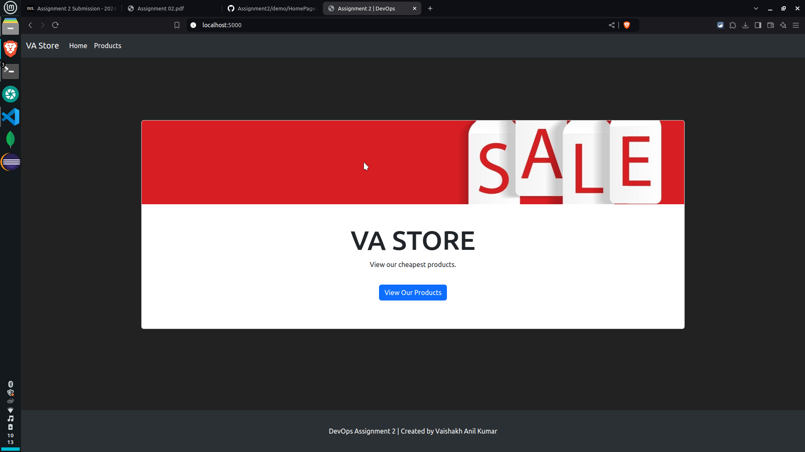
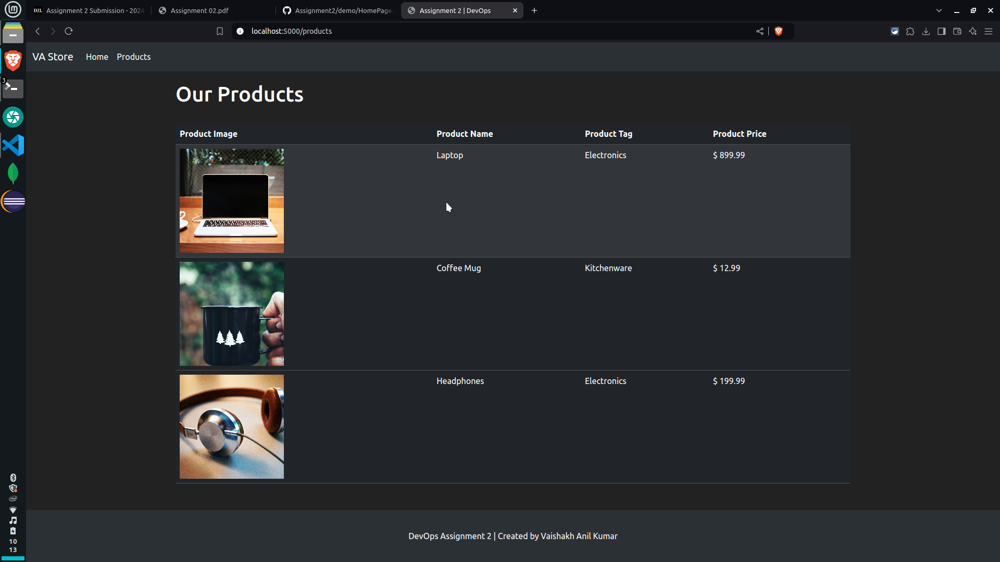

# DevOps Assignment: E-commerce Flask Application
---


### Running the project:

```
cd flask_app/
python3 -m venv assignment
source .assignment/bin/activate
pip install -r requirements.txt
python3 app.py
```
Create assignment virtual environment, install the dependencies and run the application

> [!NOTE]
> Created a .env file to store MONGO_USERNAME & MONGO_PASSWORD, so the username and password is not pushed to git

### Demo Images:

Home Page | Products Page
------------ | ------------- 
 | 


### Assignment 03
- [x] 1. Modify your flask application to load .env
- [x] 2. Update .gitignore

### Assignment 02

- [x] 1. Set Up MongoDB Atlas
- [x] 2. Set Up Flask Application
- [x] 3. Connecting to MongoDB Atlas
- [x] 4. Creating Routes
    - [x] Homepage (/)
    - [x] Products Page (/products):
- [x] 5. Template and Bootstrap Integration
- [x] 6. Testing Application

### Assignment 04

- [x] 1. Creating Test Cases:
    - [x] Test 1: Route Test
    - [x] Test 2: Database Read Operation - Using Ping
    - [x] Test 3: Database Write Operation
- [x] 2. Unit Test Integration with Github Actions
    - [x] Create .github/workflows/main.yml file
